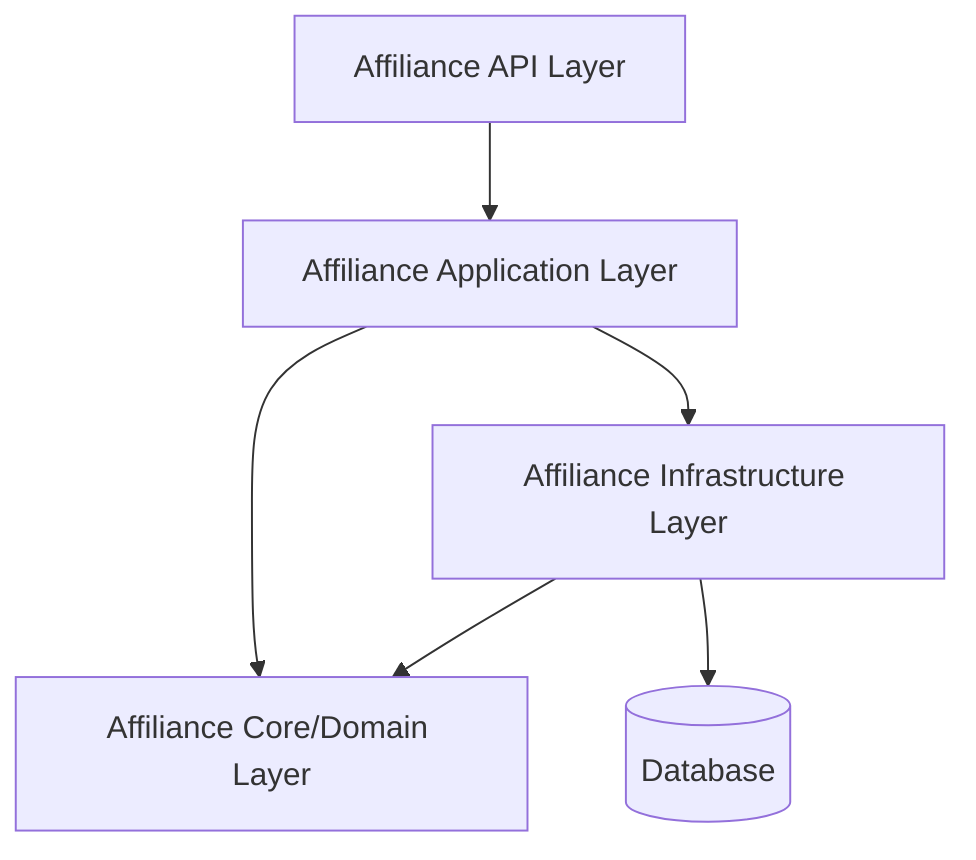

<div align="center">

# 🚀 Affiliance API

<p align="center">
  
  
  
  
</p>

<p align="center">
  <strong>A comprehensive affiliate marketing platform API built with ASP.NET Core</strong>
</p>

</div>

---

## 📋 Table of Contents

- [Overview](#overview)
- [Features](#features)
- [Architecture](#architecture)
- [Technology Stack](#technology-stack)
- [Getting Started](#getting-started)
- [Project Structure](#project-structure)
- [API Endpoints](#api-endpoints)
- [Testing](#testing)
- [Contributing](#contributing)

---

## 🎯 Overview

**Affiliance** is a robust Web API designed for managing affiliate marketing operations. It provides a complete solution for handling companies, marketers, campaigns, tracking links, reviews, and analytics.

<div style="background: linear-gradient(135deg, #667eea 0%, #764ba2 100%); padding: 20px; border-radius: 10px; color: white; margin: 20px 0;">
  <h3 style="margin: 0; color: white;">✨ Key Highlights</h3>
  <ul style="color: white;">
    <li>Clean Architecture with Domain-Driven Design</li>
    <li>RESTful API with comprehensive endpoints</li>
    <li>Entity Framework Core for data persistence</li>
    <li>Automated testing suite</li>
    <li>File upload management for documents and images</li>
  </ul>
</div>

---

## ✨ Features

<table>
  <tr>
    <td width="50%" valign="top">
      <h3>🏢 Company Management</h3>
      <ul>
        <li>Company registration and profiles</li>
        <li>Logo and document uploads</li>
        <li>Commercial register management</li>
        <li>Company verification system</li>
      </ul>
    </td>
    <td width="50%" valign="top">
      <h3>👤 Marketer Management</h3>
      <ul>
        <li>Marketer registration and profiles</li>
        <li>ID verification and document upload</li>
        <li>CV management</li>
        <li>Performance tracking</li>
      </ul>
    </td>
  </tr>
  <tr>
    <td width="50%" valign="top">
      <h3>📢 Campaign Management</h3>
      <ul>
        <li>Create and manage campaigns</li>
        <li>Category-based organization</li>
        <li>Campaign performance analytics</li>
        <li>Budget and commission tracking</li>
      </ul>
    </td>
    <td width="50%" valign="top">
      <h3>🔗 Tracking & Analytics</h3>
      <ul>
        <li>Unique tracking link generation</li>
        <li>Click and conversion tracking</li>
        <li>Real-time analytics</li>
        <li>Revenue attribution</li>
      </ul>
    </td>
  </tr>
  <tr>
    <td width="50%" valign="top">
      <h3>⭐ Review System</h3>
      <ul>
        <li>Product and service reviews</li>
        <li>Rating system</li>
        <li>Review moderation</li>
        <li>Feedback management</li>
      </ul>
    </td>
    <td width="50%" valign="top">
      <h3>📂 Category System</h3>
      <ul>
        <li>Hierarchical categories</li>
        <li>Multiple classification levels</li>
        <li>Category-based filtering</li>
        <li>Dynamic category management</li>
      </ul>
    </td>
  </tr>
</table>

---

## 🏗️ Architecture

The project follows **Clean Architecture** principles with clear separation of concerns:



### Layers:

- **`Affiliance/`** - API Layer (Controllers, HTTP endpoints)
- **`Affiliance_Application/`** - Application Layer (Services, business logic)
- **`Affiliance_core/`** - Domain Layer (Entities, DTOs, interfaces)
- **`Affiliance_Infrastructure/`** - Infrastructure Layer (Data access, repositories, EF migrations)
- **`Affiliance_Tests/`** - Testing Layer (Unit and integration tests)

---

## 🛠️ Technology Stack

<div style="background-color: #f6f8fa; padding: 20px; border-radius: 8px; border-left: 4px solid #0366d6;">

### Backend
- **Framework:** ASP.NET Core 6.0+
- **Language:** C# 10.0+
- **ORM:** Entity Framework Core
- **Database:** SQL Server
- **Architecture:** Clean Architecture / DDD

### Tools & Libraries
- **AutoMapper** - Object-object mapping
- **ML.NET** - Machine Learning capabilities
- **xUnit/NUnit** - Testing framework
- **Swagger/OpenAPI** - API documentation

</div>

---

## 🚀 Getting Started

### Prerequisites

```bash
# Required software
- .NET SDK 6.0 or higher
- SQL Server 2019 or higher
- Visual Studio 2022 / VS Code
- Git
```

### Installation

<div style="background-color: #0d1117; color: #c9d1d9; padding: 20px; border-radius: 8px; font-family: 'Courier New', monospace;">

**1. Clone the repository**
```bash
git clone https://github.com/yourusername/affiliance.git
cd affiliance
```

**2. Restore dependencies**
```bash
dotnet restore
```

**3. Update database connection string**

Edit `appsettings.json` in the `Affiliance/` project:
```json
{
  "ConnectionStrings": {
    "DefaultConnection": "Server=YOUR_SERVER;Database=Affiliance;Trusted_Connection=True;"
  }
}
```

**4. Apply migrations**
```bash
cd Affiliance_Infrastructure
dotnet ef database update
```

**5. Run the application**
```bash
cd ../Affiliance
dotnet run
```

**6. Access the API**
- API: `https://localhost:7xxx`
- Swagger UI: `https://localhost:7xxx/swagger`

</div>

---

## 📁 Project Structure

```
Affiliance/
├── 📄 Affiliance.sln                    # Solution file
├── 📄 README.md                         # This file
├── 📄 USER_FLOW_GUIDE.md               # User flow documentation
├── 🧪 *_Test_Script.ps1                # PowerShell test scripts
│
├── 🎯 Affiliance/                       # API Layer
│   ├── Controllers/                    # API Controllers
│   ├── Extensions/                     # Extension methods
│   ├── uploads/                        # File upload storage
│   └── Program.cs                      # Application entry point
│
├── 💼 Affiliance_Application/           # Application Layer
│   └── services/                       # Business logic services
│       ├── AccountService.cs
│       ├── CampaignService.cs
│       ├── CompanyService.cs
│       ├── CategoryService.cs
│       ├── MarketerService.cs
│       ├── ReviewService.cs
│       └── TrackingLinkService.cs
│
├── 🏛️ Affiliance_core/                  # Domain Layer
│   ├── Entities/                       # Domain entities
│   ├── Dto/                           # Data transfer objects
│   ├── interfaces/                     # Service interfaces
│   └── ApiHelper/                      # Helper classes
│
├── 🗄️ Affiliance_Infrastructure/        # Infrastructure Layer
│   ├── Data/                          # DbContext
│   ├── Migrations/                     # EF Core migrations
│   ├── Repository/                     # Data repositories
│   ├── MappingProfile/                 # AutoMapper profiles
│   ├── Services/                       # Infrastructure services
│   └── MLModel/                        # ML.NET models
│
└── 🧪 Affiliance_Tests/                 # Testing Layer
    ├── MarketerServiceTests.cs
    ├── ReviewServiceTests.cs
    └── TrackingLinkServiceTests.cs
```

---

## 🔌 API Endpoints

<details open>
<summary><strong>Account Management</strong></summary>

```http
POST   /api/account/register
POST   /api/account/login
GET    /api/account/profile
PUT    /api/account/update
```

</details>

<details>
<summary><strong>Company Management</strong></summary>

```http
GET    /api/company
GET    /api/company/{id}
POST   /api/company
PUT    /api/company/{id}
DELETE /api/company/{id}
POST   /api/company/upload-logo
POST   /api/company/upload-register
```

</details>

<details>
<summary><strong>Marketer Management</strong></summary>

```http
GET    /api/marketer
GET    /api/marketer/{id}
POST   /api/marketer
PUT    /api/marketer/{id}
DELETE /api/marketer/{id}
POST   /api/marketer/upload-cv
POST   /api/marketer/upload-id
```

</details>

<details>
<summary><strong>Campaign Management</strong></summary>

```http
GET    /api/campaign
GET    /api/campaign/{id}
POST   /api/campaign
PUT    /api/campaign/{id}
DELETE /api/campaign/{id}
GET    /api/campaign/by-category/{categoryId}
```

</details>

<details>
<summary><strong>Category Management</strong></summary>

```http
GET    /api/category
GET    /api/category/{id}
POST   /api/category
PUT    /api/category/{id}
DELETE /api/category/{id}
```

</details>

<details>
<summary><strong>Tracking Links</strong></summary>

```http
GET    /api/trackinglink
GET    /api/trackinglink/{id}
POST   /api/trackinglink
GET    /api/trackinglink/stats/{id}
```

</details>

<details>
<summary><strong>Reviews</strong></summary>

```http
GET    /api/review
GET    /api/review/{id}
POST   /api/review
PUT    /api/review/{id}
DELETE /api/review/{id}
```

</details>

---

## 🧪 Testing

The project includes comprehensive test coverage with automated test scripts:

### Run Unit Tests

```powershell
# Run all tests
dotnet test

# Run specific test project
dotnet test Affiliance_Tests/Affiliance_Tests.csproj
```

### PowerShell Test Scripts

```powershell
# Test individual modules
.\Company_Test_Script.ps1
.\Campaign_Test_Script.ps1
.\Category_Test_Script.ps1
.\Review_Test_Script.ps1
.\TrackingLink_Test_Script.ps1

# Complete integration test
.\Company_Complete_Test.ps1
```

### Test Coverage

<table>
  <tr>
    <th>Module</th>
    <th>Test File</th>
    <th>Coverage</th>
  </tr>
  <tr>
    <td>Marketer Service</td>
    <td>MarketerServiceTests.cs</td>
    <td>✅ Implemented</td>
  </tr>
  <tr>
    <td>Review Service</td>
    <td>ReviewServiceTests.cs</td>
    <td>✅ Implemented</td>
  </tr>
  <tr>
    <td>Tracking Link Service</td>
    <td>TrackingLinkServiceTests.cs</td>
    <td>✅ Implemented</td>
  </tr>
</table>

---

## 📚 Documentation

- **[User Flow Guide](USER_FLOW_GUIDE.md)** - Complete user journey documentation
- **[Campaign API Test Guide](Campaign_API_Test_Guide.md)** - Campaign endpoint testing
- **[Category API Test Guide](Category_API_Test_Guide.md)** - Category endpoint testing
- **Swagger UI** - Interactive API documentation at `/swagger`

---

## 🤝 Contributing

<div style="background: linear-gradient(90deg, #00C9FF 0%, #92FE9D 100%); padding: 15px; border-radius: 8px;">

We welcome contributions! Please follow these steps:

1. **Fork** the repository
2. **Create** a feature branch (`git checkout -b feature/AmazingFeature`)
3. **Commit** your changes (`git commit -m 'Add some AmazingFeature'`)
4. **Push** to the branch (`git push origin feature/AmazingFeature`)
5. **Open** a Pull Request

</div>

### Coding Standards

- Follow C# naming conventions
- Write unit tests for new features
- Update documentation as needed
- Keep commits atomic and descriptive

---

## 📄 License

This project is licensed under the MIT License - see the [LICENSE](LICENSE) file for details.

---

## 👥 Authors

- **Your Team Name** - *Initial work*

---

## 🙏 Acknowledgments

- ASP.NET Core team for the excellent framework
- Entity Framework Core for seamless data access
- The open-source community for invaluable tools and libraries

---

<div align="center">

### 🌟 Star this repository if you find it helpful! 🌟

<p style="color: #666; font-size: 0.9em; margin-top: 20px;">
  Made with ❤️ by the Affiliance Team
</p>

<p>
  <a href="#-affiliance-api" style="text-decoration: none; color: #0366d6;">⬆ Back to Top</a>
</p>

</div>
